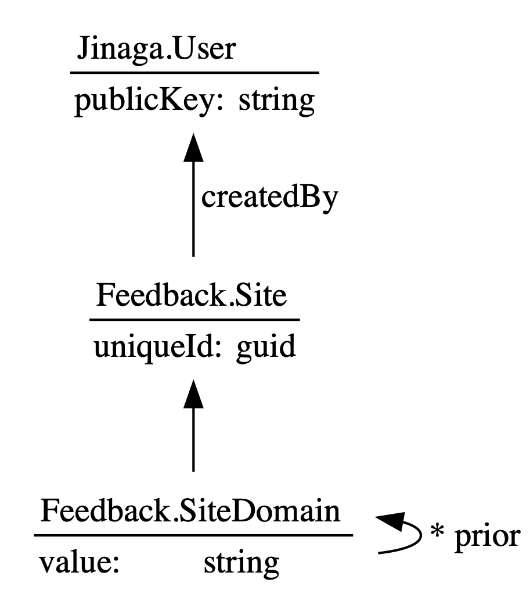
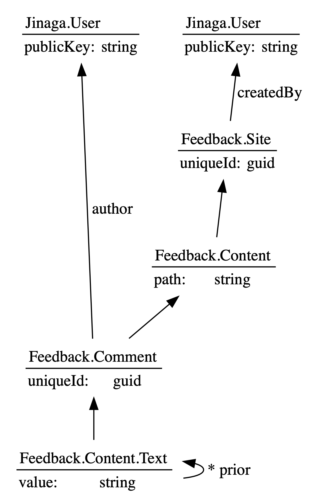

# Feedback

Jinaga model for adding feedback to a website.

## Why build Feedback?

I create static sites using Gatsby.
These sites don't have a database back end, yet I want to engage in conversation with my readers.
I don't want to cede ownership of the discourse to a third party.
And so I'm building a model that I can own.

And you can own it too.

## How is it built?

Feedback is built on [Jinaga](https://jinaga.com).
Jinaga is middleware that manages immutable data.
The model is built in TypeScript and runs in the browser so that it can be easily embedded in a single-page app.
The back end is application agnostic, which makes it portable.

Because its written in Jinaga, the Feedback model supports offline storage.
It can be used in Progressive Web Apps (PWAs) and mobile apps.
It also supports collaboration.
Visitors to the site can have one view of the data, while the site owner can have a different view.
The site owner's application will update in real time as visitors post comments.

## How can I use it?

Because the back end is portable, you can install it and run it yourself.
Alternatively, you can rent space from anyone running a Jinaga back end.
You can just embed the front end into your static site and hook it up to whatever back end you choose.
Instructions on setting up a back end and embedding the front end are coming soon.

## How does it work?

This project started as a Jinaga sample.
Feel free to use it as such, even if you are not interested in embedding a Feedback app in your site.

As a site owner, you create a `Site` fact.
To help you keep track of multiple sites, you can document the `SiteDomain`.



Then a reader visits a page and writes a comment.
The page is identified simply by the path.
The comment text can be changed by defining a new version and pointing to the old one.



When a visitor first arrives at a page, the page starts with the `Content` fact based on that path.
It then queries for all comments on that content, and all text for those comments.
This is accomplished using the following template functions.

```typescript
export class Comment {
  //...

  static isDeleted(comment: Comment) {
    return j.exists(<CommentDelete>{
      type: CommentDelete.Type,
      comment
    });
  }

  static forContent(content: Content) {
    return j.match(<Comment>{
      type: Comment.Type,
      content
    }).suchThat(j.not(Comment.isDeleted));
  }
}

export class CommentText {
  //...

  static isCurrent(commentText: CommentText) {
    return j.notExists(<CommentText>{
      type: CommentText.Type,
      prior: [commentText]
    });
  }

  static forComment(comment: Comment) {
    return j.match(<CommentText>{
      type: CommentText.Type,
      comment
    });
  }
}

await j.query(content, j.for(Comment.forContent)
  .then(CommentText.forComment));
```

When using the React UI, it uses the following bindings:

```tsx
const commentSpecification = specificationFor(Comment, {
  text: property(j.for(CommentText.forComment), ct => value, "")
});

const commentMapping = mapProps(commentSpecification).to({ text } => (
  <div>{text}</div>
));

const contentSpecification = specificationFor(Content, {
  Comments: collection(j.for(Comment.forContent), commentMapping)
});

const contentMapping = mapProps(contentSpecification).to({ Comments } => (
  <div>
    <Comments />
  </div>
));

const ContentContainer = jinagaContainer(contentMapping);
```